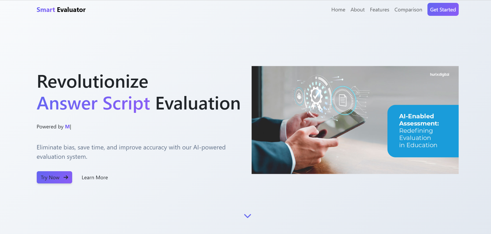

# Smart Evaluator

A web application that uses OCR and AI to evaluate student answers against teacher answers.

## 🎥 Demo Video

  

_Note: Live preview is unavailable due to Cloud Vision API cost. Please watch the demo to understand project functionality._

